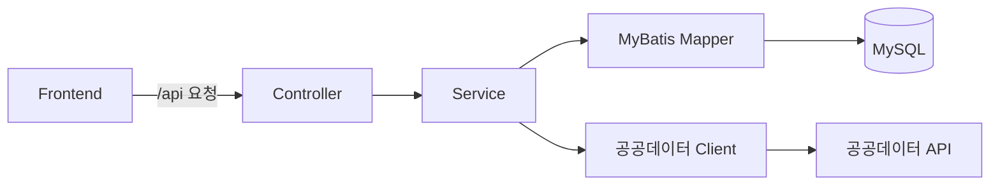
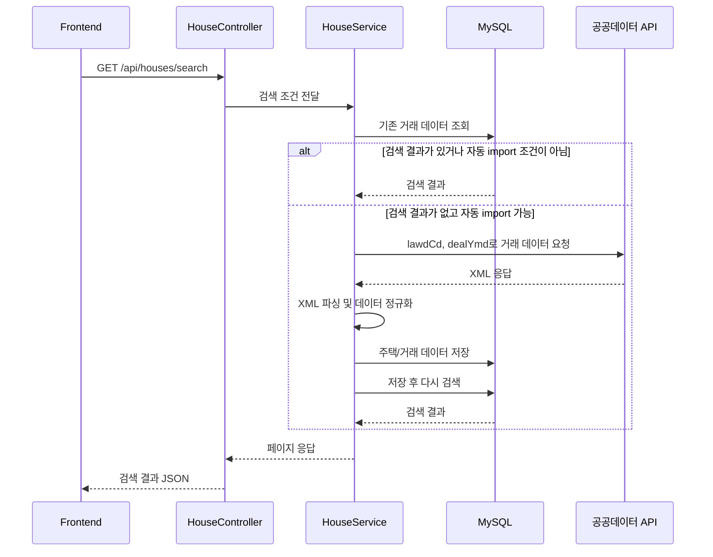

# NoHome Backend

NoHome의 Spring Boot API 서버입니다. 공공데이터 아파트 매매 실거래가를 조회하고, 필요한 경우 외부 공공데이터 API에서 거래 데이터를 가져와 MySQL에 저장합니다.

전체 프로젝트 실행 순서는 `Artifact` 저장소의 `README.md`를 확인하세요.

## 기술 스택

- Java 17
- Spring Boot
- Spring AI (OpenAI 호환, SSAFY GMS 프록시 — AI 챗봇)
- Maven
- MyBatis
- MySQL
- Docker Compose

## Docker 구성

Backend 저장소에는 Spring Boot 애플리케이션 이미지를 만들기 위한 `Dockerfile`과 빌드 context를 정리하기 위한 `.dockerignore`가 있습니다.

전체 서비스를 Docker로 실행할 때는 `Artifact/docker-compose.yml`이 이 저장소의 `Dockerfile`을 사용해 Backend 이미지를 빌드합니다.

```text
Artifact/docker-compose.yml
  -> ../Backend/Dockerfile
  -> backend 서비스 컨테이너
```

## DB 실행 방법

Backend 저장소의 `docker-compose.yml`은 로컬 개발용 MySQL 컨테이너만 실행합니다. Backend와 Frontend까지 함께 Docker로 실행하려면 `Artifact` 저장소의 `docker-compose.yml`을 사용합니다.

```powershell
docker compose up -d mysql
```

컨테이너 상태 확인:

```powershell
docker compose ps
```

컨테이너 로그 확인:

```powershell
docker compose logs mysql
```

MySQL을 중지하려면 아래 명령어를 사용합니다.

```powershell
docker compose down
```

## 환경 변수

처음 실행할 때 예시 파일을 복사해 `.env`를 만듭니다.

```powershell
Copy-Item .env.example .env
```

이 명령은 `Backend/.env.example`에 들어 있는 기본값과 예시값을 `Backend/.env`로 복사합니다. 따라서 `.env.example`에는 로컬 실행에 필요한 기본 DB 설정과 비어 있는 API key 항목이 미리 준비되어 있어야 합니다.

실제 공공데이터 API key, 개인 DB 비밀번호처럼 외부에 공개하면 안 되는 값은 `.env.example`이 아니라 복사 후 생성된 `.env`에 입력합니다.

주요 환경 변수:

```text
MYSQL_PORT=3306
DB_URL=jdbc:mysql://localhost:3306/no_home?serverTimezone=Asia/Seoul&characterEncoding=UTF-8
DB_USERNAME=no_home
DB_PASSWORD=no_home_dev_password
PUBLIC_DATA_SERVICE_KEY=
KAKAO_MAP_API_KEY=
SSAFY_GMS_API_KEY=
AI_CHAT_RATE_LIMIT_ENABLED=true
```

- `MYSQL_PORT`: Docker MySQL이 로컬에 노출할 포트
- `DB_URL`: Spring Boot가 접속할 MySQL JDBC URL
- `DB_USERNAME`: DB 사용자명
- `DB_PASSWORD`: DB 비밀번호
- `PUBLIC_DATA_SERVICE_KEY`: 공공데이터 아파트 매매 실거래가 API key
- `KAKAO_MAP_API_KEY`: Kakao API key
- `SSAFY_GMS_API_KEY`: AI 챗봇용 SSAFY GMS(OpenAI 프록시) API key. 미설정 시 앱은 정상 기동되고 `/api/ai/chat`만 503(챗봇 비활성), 무효/만료 키는 호출 시 런타임 503
- `AI_CHAT_RATE_LIMIT_ENABLED`: AI 챗봇 호출 리미터(분당 한도 429·동시요청 409). 기본 `true`, 내부 테스트 시 `false`로 우회. (AI 챗봇 관련 추가 옵션은 `.env.example` 참고)

`.env`는 로컬 비밀값을 포함할 수 있으므로 원격 저장소에 커밋하지 않습니다.

## 아키텍처



## 패키지 구조

```text
src/main/java/com/ssafy/home/
  ai/              AI 챗봇 (Spring AI ChatClient, HouseTools, 사용량 리미터)
  common/
    health/        상태 확인 API
    region/        서울 법정동 보정 데이터
    text/          문자열 인코딩 보정
  house/           지역, 주택, 매매거래 검색
  member/          회원가입, 로그인, 로그아웃
  publicdata/      공공데이터 API 호출 및 DB 저장
```

```text
src/main/resources/
  mappers/
    house/
    member/
    publicdata/
```

## API 구조

| Method | Path | 설명 |
| --- | --- | --- |
| `GET` | `/api/health` | 백엔드와 DB 연결 상태 확인 |
| `GET` | `/api/regions` | 구 코드 기준 동 목록 조회 |
| `GET` | `/api/houses/search` | 아파트 매매거래 검색 |
| `GET` | `/api/houses` | 주택 목록 조회 |
| `GET` | `/api/house-deals` | 거래 목록 조회 |
| `POST` | `/api/public-data/apt-trades/import` | 공공데이터 수동 import |
| `POST` | `/api/members` | 회원가입 |
| `POST` | `/api/auth/login` | 로그인 |
| `POST` | `/api/auth/logout` | 로그아웃 |
| `GET` | `/api/members/me` | 현재 로그인 사용자 조회 |
| `POST` | `/api/ai/chat` | AI 챗봇 — 서울 아파트 실거래가 질의 (**로그인 전용**, `/api/ai/**` 인터셉터) |

## 검색 및 자동 import 흐름



자동 import는 `lawdCd`, `dealYmd`, `autoImport=true`가 전달된 검색 요청에서 동작합니다.
