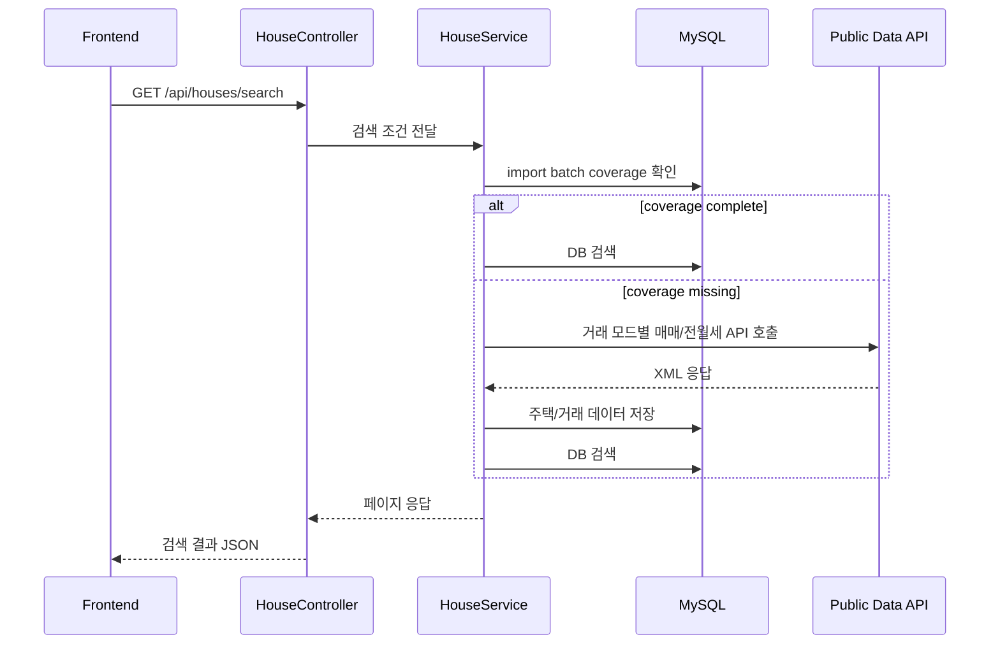

# NoHome Backend

NoHome의 Spring Boot API 서버입니다. 공공데이터 아파트 매매 실거래가와 아파트 전월세 실거래가를 조회하고, 필요한 경우 외부 공공데이터 API에서 거래 데이터를 가져와 MySQL에 저장한 뒤 DB 기반으로 검색합니다.

전체 서비스를 Docker로 실행할 때는 `no-home-artifact/docker-compose.yml`을 사용합니다.

## 기술 스택

- Java 17
- Spring Boot
- Spring AI
- Maven
- MyBatis
- MySQL
- Docker Compose

## 환경 변수

처음 실행할 때 예시 파일을 복사해 `.env`를 만듭니다.

```powershell
Copy-Item .env.example .env
```

주요 환경 변수:

```text
MYSQL_PORT=3306
DB_URL=jdbc:mysql://localhost:3306/no_home?serverTimezone=Asia/Seoul&characterEncoding=UTF-8
DB_USERNAME=no_home
DB_PASSWORD=no_home_dev_password
PUBLIC_DATA_SERVICE_KEY=
PUBLIC_DATA_APT_RENT_SERVICE_KEY=
KAKAO_MAP_API_KEY=
SSAFY_GMS_API_KEY=
AI_CHAT_RATE_LIMIT_ENABLED=true
```

- `PUBLIC_DATA_SERVICE_KEY`: 국토교통부 아파트 매매 실거래가 API key
- `PUBLIC_DATA_APT_RENT_SERVICE_KEY`: 국토교통부 아파트 전월세 실거래가 API key
- 두 공공데이터 키는 별도로 필요합니다.

## DB 실행

Backend 저장소의 `docker-compose.yml`은 로컬 개발용 MySQL 컨테이너만 실행합니다.

```powershell
docker compose up -d mysql
docker compose ps
docker compose logs mysql
docker compose down
```

Backend, Frontend, MySQL을 함께 실행하려면 `no-home-artifact` 저장소에서 실행합니다.

## 패키지 구조

```text
src/main/java/com/ssafy/home/
  ai/              AI 챗봇
  common/          공통 설정, 헬스체크, 지역 보정, 문자 인코딩 보정
  house/           지역, 주택, 실거래가 검색
  member/          회원가입, 로그인, 로그아웃
  publicdata/      공공데이터 API 호출 및 DB 저장
```

## 주요 API

| Method | Path | 설명 |
| --- | --- | --- |
| `GET` | `/api/health` | 백엔드와 DB 연결 상태 확인 |
| `GET` | `/api/regions` | 구 코드 기준 법정동 목록 조회 |
| `GET` | `/api/houses/search` | 아파트 매매/전세/월세/전월세/전체 실거래가 검색 |
| `GET` | `/api/houses/price-range` | 검색 조건 기준 가격 범위 조회 |
| `POST` | `/api/public-data/apt-trades/import` | 공공데이터 수동 import |
| `POST` | `/api/members` | 회원가입 |
| `POST` | `/api/auth/login` | 로그인 |
| `POST` | `/api/auth/logout` | 로그아웃 |
| `GET` | `/api/members/me` | 현재 로그인 사용자 조회 |
| `POST` | `/api/ai/chat` | AI 챗봇 질의 |

## 실거래가 검색 파라미터

`GET /api/houses/search`는 다음 거래 모드를 지원합니다.

| `dealMode` | 의미 | 가격 필터/정렬 |
| --- | --- | --- |
| `sale` | 매매 | `minPrice`, `maxPrice`, 가격순 |
| `jeonse` | 전세 | `minDeposit`, `maxDeposit`, 보증금순 |
| `monthly` | 월세 | `minDeposit`, `maxDeposit`, `minMonthlyRent`, `maxMonthlyRent`, 보증금순, 월세순 |
| `rent` | 전세 + 월세 | 가격 필터와 가격순 비활성 |
| `all` | 매매 + 전세 + 월세 | 가격 필터와 가격순 비활성 |

기본값은 기존 호환을 위해 `sale`입니다.

월 조건은 단일월 또는 범위 검색을 지원합니다.

- 단일월: `dealYmd=202605`
- 범위: `startDealYmd=202601&endDealYmd=202606`

자동수집은 해석 가능한 서울 자치구와 명시적인 단일월 또는 월 범위가 있을 때 동작합니다.

## 공공데이터 API

매매와 전월세는 서로 다른 API를 사용합니다.

```text
매매:
https://apis.data.go.kr/1613000/RTMSDataSvcAptTrade/getRTMSDataSvcAptTrade

전월세:
https://apis.data.go.kr/1613000/RTMSDataSvcAptRent/getRTMSDataSvcAptRent
```

공통 요청 파라미터:

- `serviceKey`
- `LAWD_CD`
- `DEAL_YMD`
- `pageNo`
- `numOfRows`

전세/월세 구분은 전월세 API 응답의 월세 금액을 기준으로 서버에서 산출합니다.

```text
monthlyRent == 0  -> jeonse
monthlyRent > 0   -> monthly
```

## 자동 import 흐름



공공데이터 응답 코드 `03`은 “데이터 없음”으로 보고 정상 빈 응답으로 처리합니다. 키 오류, 쿼터 초과, 공급자 오류는 자동수집 실패로 분류합니다.

## 테스트

```powershell
.\mvnw.cmd test
```
