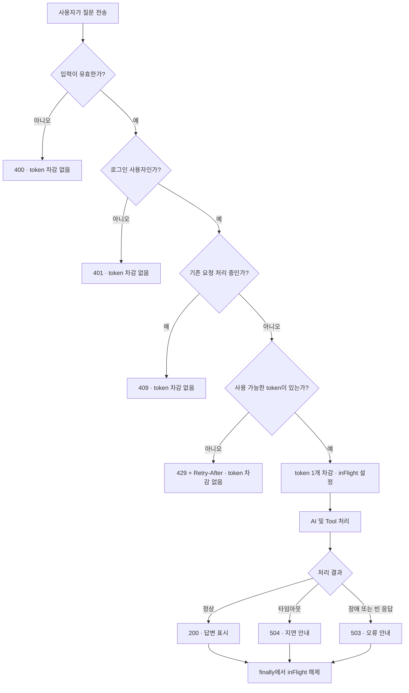

# AI 챗봇 사용량 리미터 및 UX 사용자 시나리오

## 1. 목적과 범위

AI 챗봇의 입력 제한, 사용자별 호출 제한, 타임아웃·재시도 정책이 실제 사용자 경험에 어떻게 나타나는지를 제품·프론트엔드·백엔드·QA 관점에서 정의한다. 현재 구현의 동작을 기준으로 하며, 아직 구현되지 않은 운영 안전망은 별도로 구분한다.

여기서 현재의 **동적 사용량 조절**은 고정된 1분 창을 한 번에 초기화하는 방식이 아니라, 경과 시간에 따라 token을 연속 보충하고 다음 사용 가능 시간을 동적으로 계산하는 것을 뜻한다. 서버 부하나 AI 공급자 상태에 따라 한도를 자동 증감하는 적응형 제어는 후속 범위다.

## 2. 현재 적용 정책

| 항목 | 현재 정책 | 사용자에게 보이는 결과 |
|---|---|---|
| 메시지 길이 | Unicode code point 기준 최대 500자 | 입력창 카운터와 `maxlength`, 초과 요청은 400 |
| 단기 사용량 | 로그인 사용자별 최대 10 token | 짧은 시간에 연속 사용 가능 |
| token 보충 | 분당 10개를 연속 보충(약 6초마다 1개) | 한도 소진 후에도 전체 1분을 기다리지 않고 순차 재사용 가능 |
| 요청 비용 | 유효한 AI 요청 1건당 1 token | 성공 여부와 무관하게 모델 처리를 시작한 요청은 사용량에 포함 |
| 동시 요청 | 사용자별 1건 | 처리 중 재전송은 409, token은 차감하지 않음 |
| HTTP 연결 제한 | 연결 3초 | 공급자 연결 실패를 오래 끌지 않음 |
| HTTP 응답 제한 | 각 HTTP 호출의 응답 25초 | 제한 초과 시 최종적으로 504 가능 |
| AI 재시도 | 최초 호출을 포함해 최대 2회 시도 | 일시 오류 회복 가능성이 높아지는 대신 최악 지연이 늘 수 있음 |
| 인증 | 로그인 사용자만 허용 | 인증 식별자가 없으면 401 |

모든 제한값은 환경변수로 재정의할 수 있다. 단, 25초는 챗 요청 전체의 마감 시간이 아니라 AI 공급자에 대한 **개별 HTTP 호출의 응답 제한**이므로 Tool 호출과 재시도가 섞인 전체 처리 시간은 더 길어질 수 있다.

## 3. 요청 처리 흐름

프론트 입력 잠금은 동일 화면에서의 중복 요청을 사전에 막는 UX 장치이고, 백엔드의 `inFlight` 검사는 여러 탭·직접 API 호출·네트워크 중복과 같은 우회 경로까지 막는 최종 안전망이다.

## 4. 정상 요청의 UX 시간선

| 시점 | 화면 상태 | 입력 상태 | 사용자 해석 |
|---|---|---|---|
| 전송 직후 | 사용자 메시지를 즉시 대화창에 추가하고 “질문을 전송했어요. 답변을 기다리고 있어요…” 표시 | 입력창과 전송 버튼 잠금, 버튼은 “답변 중” | 질문이 접수되었음을 확인 |
| 3초 경과 | “실거래가 데이터를 확인하고 있어요…” 표시 | 잠금 유지 | DB·Tool 조회가 진행 중임을 이해 |
| 12초 경과 | “답변이 평소보다 오래 걸리고 있어요. 조금만 더 기다려주세요…” 표시 | 잠금 유지 | 멈춘 화면이 아니라 지연 상태임을 인지 |
| 성공 | AI 답변 추가, 로딩 표시 제거 | 잠금 해제 | 다음 질문 가능 |
| 오류 | 상태별 안내 표시, 로딩 표시 제거 | 잠금 해제 | 재시도 여부 판단 가능 |

로딩 컨테이너에는 `aria-busy`, 상태 메시지에는 `role="status"`와 `aria-live`를 사용해 보조기기에도 진행 상태가 전달된다.

## 5. 사용자 시나리오

### SC-01. 정상 질문과 응답

- 조건: 로그인 상태, 메시지 1~500자, 사용 가능한 token 존재, 진행 중 요청 없음.
- 처리: 프론트는 질문을 즉시 표시하고 입력을 잠근다. 백엔드는 token 1개를 차감하고 AI 처리를 시작한다.
- 결과: 200 응답을 대화창에 추가한 후 입력 잠금을 해제한다.
- 인수 기준: 사용자가 전송 성공 여부와 처리 중 상태를 명확히 구분할 수 있어야 하며, 처리 중 추가 요청이 발생하지 않아야 한다.

### SC-02. 같은 화면에서 연속 전송

- 조건: 첫 질문이 아직 처리 중이다.
- 처리: Enter와 전송 버튼이 비활성화되어 두 번째 요청을 보내지 않는다.
- 결과: 추가 token 차감이나 중복 답변이 없다.
- 인수 기준: 버튼에 “답변 중”이 표시되고 입력창이 잠겨야 한다.

현재 UX는 **잠금 방식**이다. 답변 생성 중 새 질문으로 방향을 바꾸는 steering이나 취소는 지원하지 않는다.

### SC-03. 여러 탭 또는 직접 API로 동시 요청

- 조건: 같은 사용자의 첫 요청이 백엔드에서 처리 중인 동안 다른 탭에서 요청한다.
- 처리: 백엔드가 두 번째 요청을 409로 거절한다.
- token: 두 번째 요청은 차감하지 않는다.
- 권장 안내: “이미 다른 창에서 답변을 생성하고 있어요. 현재 답변이 끝난 뒤 다시 질문해주세요.”
- 인수 기준: 첫 요청은 계속 처리되고, 두 번째 요청만 종료되어야 한다.

### SC-04. 단기 사용량 소진

- 조건: 사용자가 짧은 시간에 유효한 요청을 반복해 token을 모두 사용한다.
- 처리: 다음 요청은 429와 동적 `Retry-After`를 반환한다.
- token: 거절된 요청은 차감하지 않는다.
- UX: 현재 프론트는 응답 헤더를 읽어 “N초 후 다시 시도”할 수 있음을 알린다.
- 인수 기준: 고정된 “1분 후”가 아니라 실제 다음 token 보충 시점에 맞는 대기 시간을 표시해야 한다.

예를 들어 초기 10 token을 빠르게 사용했다면 약 6초마다 1회씩 다시 사용할 수 있다. 이는 고정 윈도 방식의 분 경계 몰림을 줄이면서, 일반적인 대화 속도에는 불필요한 방해를 만들지 않기 위한 선택이다.

### SC-05. 빈 입력 또는 500자 초과

- 빈 입력: 프론트에서 전송을 막고, 우회 요청은 백엔드가 400으로 거절한다.
- 500자 초과: 프론트 `maxlength`와 카운터로 예방하고, 우회 요청은 백엔드가 400으로 거절한다.
- token: 유효성 검사를 통과하지 못한 요청은 차감하지 않는다.
- 인수 기준: 한글·이모지를 포함한 경계값 500자는 허용하고 501자는 거절해야 한다.

### SC-06. 비로그인 또는 인증 만료

- 조건: 로그인하지 않았거나 서버에서 사용자 식별자를 얻지 못한다.
- 처리: 프론트는 로그인 필요 안내를 보여주고, 백엔드는 401로 방어한다.
- token: 차감하지 않는다.
- 인수 기준: AI 호출이 시작되지 않고 내부 인증 정보가 응답에 노출되지 않아야 한다.

요청 시작 후 로그아웃한 경우 이미 인증된 요청은 완료될 수 있다. 로그아웃과 동시에 서버 작업까지 취소하려면 요청 ID와 서버 측 취소 기능이 추가로 필요하다.

### SC-07. 응답 지연 또는 타임아웃

- 조건: AI 공급자 연결·응답 또는 Tool 처리가 지연된다.
- 처리: 3초와 12초에 단계별 상태 문구를 변경한다. 최종 타임아웃은 504로 정규화한다.
- token: 모델 처리를 시작했으므로 차감한다.
- 인수 기준: 오류 후 입력 잠금이 반드시 해제되고, 사용자가 다시 시도할 수 있어야 한다.

현재의 25초 제한과 최대 2회 시도는 전체 요청 시간을 25초로 보장하지 않는다. 재시도와 여러 AI 호출을 포함한 사용자 체감 상한을 만들려면 별도의 전체 요청 deadline이 필요하다.

### SC-08. 모델·Tool 장애 또는 빈 AI 응답

- 조건: 모델 오류, Tool 조회 예외, 의미 있는 내용이 없는 AI 응답.
- 처리: 내부 예외 메시지는 숨기고 503으로 통일한다.
- token: 공급자 또는 Tool 자원이 이미 사용되었을 수 있어 차감한다.
- 인수 기준: 오류 세부 정보나 키가 사용자 응답에 노출되지 않고 입력 잠금이 해제되어야 한다.

503·504의 token을 즉시 환불하면 장애 중 무제한 재시도를 유도할 수 있다. 지속 장애의 사용자 피해를 줄이는 역할은 token 환불보다 circuit breaker와 일시 중단 안내가 맡는 편이 안전하다.

### SC-09. 챗 패널 닫기와 다시 열기

- 조건: 답변 생성 중 사용자가 챗 패널을 닫았다가 같은 페이지에서 다시 연다.
- 처리: 컴포넌트 상태가 유지되므로 기존 메시지와 로딩 상태를 다시 볼 수 있다.
- 결과: 백엔드 요청은 계속 진행되고 완료 후 잠금이 해제된다.
- 인수 기준: 패널 토글만으로 같은 요청이 다시 전송되지 않아야 한다.

### SC-10. 페이지 새로고침 또는 이탈

- 조건: 답변 생성 중 페이지를 새로고침하거나 다른 페이지로 이탈한다.
- 처리: 현재 프론트 대화 상태는 사라질 수 있지만 서버 요청은 이미 진행 중일 수 있다.
- 결과: 백엔드는 처리가 끝날 때 `inFlight`를 해제한다. 사용자가 즉시 재요청하면 잠시 409를 받을 수 있다.
- 인수 기준: 서버는 성공·실패 여부와 관계없이 `finally`에서 `inFlight`를 해제해야 한다.

새로고침 후 진행 상태를 복원하려면 요청 ID, 상태 조회 API, 대화 저장소가 필요하다.

### SC-11. 네트워크 단절

- 조건: 요청 전송 후 브라우저와 서버 사이 연결이 끊긴다.
- 처리: 프론트는 네트워크 오류를 안내하고 잠금을 해제한다. 서버가 요청을 이미 수신했다면 AI 처리는 계속될 수 있다.
- token: 서버가 limiter를 통과해 처리를 시작했다면 차감될 수 있다.
- 인수 기준: 클라이언트 오류만으로 “서버 작업도 취소됨”이라고 표시하지 않아야 한다.

단순한 브라우저 `AbortController`는 화면의 대기만 중단할 뿐 서버·공급자 비용까지 확실히 취소하지 못할 수 있다. 취소 버튼을 제공하려면 요청 ID 기반의 서버 취소 계약을 먼저 설계해야 한다.

## 6. 상태별 token 처리 기준

| 결과 | HTTP | token 차감 | 판단 근거 |
|---|---:|---|---|
| 정상 응답 | 200 | 예 | 모델 요청을 정상 수행 |
| 잘못된 입력 | 400 | 아니오 | AI 처리 전 검증 실패 |
| 인증 실패 | 401 | 아니오 | AI 처리 전 차단 |
| 동시 요청 | 409 | 아니오 | 기존 요청만 처리 |
| 한도 초과 | 429 | 아니오 | token을 획득하지 못함 |
| 모델·Tool 장애 또는 빈 응답 | 503 | 예 | 유효한 요청으로 처리를 시작했고 자원 사용 가능성이 있음 |
| 타임아웃 | 504 | 예 | 유효한 요청으로 처리를 시작했고 자원 사용 가능성이 있음 |

## 7. QA 인수 시나리오

- [ ] 1자, 500자 메시지는 전송되고 501자는 프론트와 백엔드에서 거절된다.
- [ ] 한글과 이모지가 포함되어도 500자 경계가 일관되게 계산된다.
- [ ] 첫 요청 처리 중 같은 화면에서 Enter와 버튼으로 추가 요청을 보낼 수 없다.
- [ ] 같은 계정의 두 탭에서 동시 요청 시 한 건만 처리되고 다른 한 건은 409이며 token이 추가 차감되지 않는다.
- [ ] 초기 10 token을 소진한 다음 요청은 429와 유효한 `Retry-After`를 받는다.
- [ ] 약 6초가 지나 token이 보충되면 전체 1분을 기다리지 않고 다시 요청할 수 있다.
- [ ] 0초·3초·12초 상태 문구가 순서대로 보이고 성공·실패 후 입력 잠금이 해제된다.
- [ ] 400·401·409·429·503·504가 사용자에게 구분 가능한 문구로 표시된다.
- [ ] 패널을 닫았다 다시 열어도 같은 페이지에서는 메시지와 진행 상태가 유지된다.
- [ ] 새로고침 후 서버 처리가 남아 있을 때 재요청이 409가 될 수 있으며, 서버 완료 뒤 다시 요청할 수 있다.
- [ ] 스크린 리더가 처리 중 상태 변경을 알리고, 키보드만으로 위젯을 이용할 수 있다.
- [ ] 내부 예외 메시지, 프롬프트 원문, API 키가 오류 응답과 로그에 노출되지 않는다.

## 8. 현재 한계와 후속 안전망

| 우선순위 | 안전망 | 해결하는 문제 |
|---|---|---|
| 1 | Redis 기반 분산 limiter | 다중 백엔드 인스턴스에서 사용자 한도가 인스턴스마다 따로 계산되는 문제 |
| 2 | 공급자 장애 circuit breaker | 장애 중 재시도 폭증과 반복 token 소모 |
| 3 | 전체 요청 deadline(초기 제안 45초) | 개별 25초 제한과 재시도로 전체 체감 시간이 길어지는 문제 |
| 4 | 사용자별 일일 한도 | 낮은 속도의 장시간 반복 사용과 비용 누적 |
| 5 | 요청 ID + 상태 조회·복원 | 새로고침·네트워크 단절 후 진행 상태를 알 수 없는 문제 |
| 6 | 서버 측 취소 계약 | steering·취소 시 실제 모델 작업과 비용까지 중단하지 못하는 문제 |
| 7 | 관측 지표와 알림 | 429 비율, 지연, 503·504, 사용자별·전체 비용 이상을 늦게 발견하는 문제 |

부하나 공급자 상태에 따라 분당 허용량을 자동으로 낮추는 적응형 limiter는 circuit breaker와 관측 지표가 준비된 뒤 도입하는 것이 적절하다. 조정 사유와 복구 시점을 사용자에게 설명하지 못하면 정상 사용자에게 임의 장애처럼 보일 수 있기 때문이다.

## 9. 검증 현황

- 백엔드 전체 테스트 72건 통과.
- 프론트 컴포넌트 테스트 3건 통과.
- 프론트 프로덕션 빌드 통과.

상세 구현·E2E 결과는 [AI 챗봇 구현 & E2E 검증 정리](2026-06-21-implementation.md), 후속 작업은 [AI 챗봇 남은 작업 백로그](2026-06-21-backlog.md)를 참고한다.
